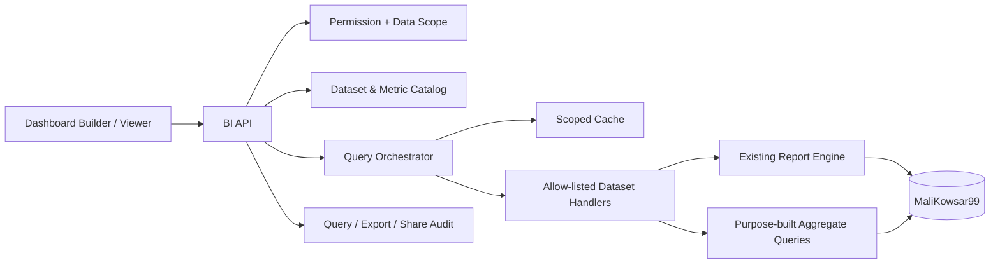

# Roadmap داشبورد مدیریتی و Self-Service BI کوثر

تاریخ تحلیل: ۲۰۲۶-۰۹-۳۰  
وضعیت: `Phase 0` تا `Phase 6 completed` و زیرساخت Pilot governance تکمیل شده است؛ Workspace شخصی، پنج Management Pack، Governance/Sharing، عملیات زمان‌بندی‌شده، Advanced Analytics و ثبت نسخه‌دار sign-off پیاده‌سازی، migrate، تست و smoke شده‌اند. Pilot مصرف واقعی همچنان منتظر topology عملیاتی است. شواهد در [MANAGEMENT-BI-CHECKPOINT.md](./MANAGEMENT-BI-CHECKPOINT.md) ثبت شده‌اند.

راهنمای استفاده کاربران، مدیران و مسئولان Catalog در [MANAGEMENT-BI-USER-GUIDE.md](./MANAGEMENT-BI-USER-GUIDE.md) قرار دارد.

## تصمیم پیشنهادی

بهترین مسیر برای Kowsar ساخت یک «Power BI کامل» نیست. پیشنهاد، ساخت `Kowsar BI Workspace` روی زیرساخت فعلی است:

- مدیر، Dashboardهای استاندارد و KPIهای تأییدشده را می‌بیند.
- هر کاربر مجاز می‌تواند از Widgetهای آماده صفحه شخصی خود را بچیند، جابه‌جا و resize کند و فیلترهایش را ذخیره کند.
- کاربر هیچ SQL، نام Table/View/Procedure یا عبارت `XCondition` وارد نمی‌کند.
- هر Widget فقط یک `DatasetKey` یا `MetricKey` ثبت‌شده در Catalog را اجرا می‌کند.
- مجوز Domain، محدوده داده و Department در Backend از هویت JWT تعیین می‌شود؛ مقدار ارسالی Browser مرجع دسترسی نیست.
- گزارش‌های فعلی حذف یا بازنویسی نمی‌شوند؛ BI روی آن‌ها Summary، Drill-through و تجربه شخصی‌سازی می‌سازد.

اولین Vertical Slice باید فقط `Sales Overview` باشد. بعد از عبور این Slice از امنیت، صحت عدد و کارایی، Catalog برای حوزه‌های مالی، انبار، خرید و عملیات گسترش پیدا می‌کند.

## مبنای بررسی‌شده

این Roadmap بر اساس کد فعلی Frontend/Backend، `docs/ROADMAP.md`، metadata فقط‌خواندنی دیتابیس توسعه `MaliKowsar99` و مستندات رسمی ابزارهای کاندید تهیه شده است.

### دارایی‌های قابل استفاده

- Angular 20 و معماری standalone/lazy-loaded در Frontend.
- `AG Grid Enterprise 34.3.1` برای Grid، فیلتر، grouping و export.
- `D3` و یک wrapper داخلی `KowsarChartColumnComponent` برای نمایش Chart.
- موتور عمومی گزارش Accounting با Catalog فعلی، `GridSchema`، خروجی `ReportColumns` و Drill-through آماده.
- ۱۶۵ رکورد در `Reports`، شامل ۱۵۱ `ReportForm` غیرخالی و ۱۴ ردیف گروه/منو.
- مطابق checkpoint قبلی، ۱۵۱ فرم ممیزی شده‌اند؛ ۱۹ گزارش تخصصی و ۱۳۲ گزارش روی موتور مشترک قرار دارند.
- ۳۲۲ رکورد `GridSchema` برای caption، visibility و نوع تقریبی ستون‌ها.
- RBAC موجود با `Permission` و `RolePermission`؛ مجوزهای Domain از جمله `REPORT_SALES_VIEW`، `REPORT_ACCOUNTING_VIEW`، `REPORT_CASH_VIEW` و `REPORT_WAREHOUSE_VIEW` از قبل وجود دارند.
- احراز هویت اجباری سراسری Backend، JWT session validation و Queryهای پارامتری/allow-listed.
- الگوهای Dashboard موجود برای Attendance، Workforce Absence، Santral و Event که برای UX، loading و API composition قابل استفاده‌اند.

### شکاف‌های تأییدشده

- جدول `XUserReports` در دیتابیس توسعه فعلی صفر رکورد دارد. `spWeb_GetReports` در این وضعیت Catalog را بدون محدودیت گزارش-به-کاربر برمی‌گرداند؛ بنابراین وجود Login به‌تنهایی مجوز BI محسوب نمی‌شود.
- `ReportWebController` احراز هویت سراسری دارد، اما endpointهای گزارش فعلی مجوزهای `REPORT_*_VIEW` را به‌صورت ریزدانه enforce نمی‌کنند.
- `Department` در UI از Session مقداردهی می‌شود، ولی Backend فعلی فقط شکل integer-list آن را validate می‌کند و مالکیت Department را از هویت کاربر اثبات نمی‌کند.
- `XUserReports.XCondition` یک قرارداد Legacy است. برای موتور BI جدید نباید raw SQL fragment یا پایه‌ی Row-Level Security باشد.
- جدول‌های قدیمی `ReportManager`، `RuntimeReport`، `ReportonReport`، `Co_UserSettings` و `Co_UserSettingsDetail` در محیط فعلی خالی‌اند. بعضی از آن‌ها SQL text یا binary setting نگه می‌دارند و برای مدل typed، versioned و قابل audit جدید مناسب نیستند.
- Component فعلی Chart فقط bar chart می‌سازد و `ApexCharts 3.33.0` را از asset سراسری load می‌کند. قبل از تبدیل آن به هسته BI باید dependency، نسخه، امنیت، license و API آن تعیین تکلیف شود.
- Dependency تخصصی برای layout قابل drag/resize در `package.json` وجود ندارد.
- تعریف رسمی Metric، owner، grain، currency، timezone، refresh SLA و Data Quality status در Catalog فعلی وجود ندارد.

### اختلاف محیطی که باید حفظ شود

Checkpoint قبلی Roadmap تعداد ۱۰۸ فرم فعال برای `admin` را ثبت کرده است، اما metadata فعلی `XUserReports=0` است. نتیجه این است که فعال‌بودن/مجوز گزارش به وضعیت محیط وابسته است و نباید از تعداد نمایش‌داده‌شده در یک محیط، مجوز داده را استنتاج کرد.

## تجربه هدف

### نقش‌ها

| نقش | قابلیت اصلی |
| --- | --- |
| `Viewer` | دیدن Dashboard مجاز، تغییر فیلتر موقت، drill-through و export مجاز |
| `Personalizer` | ساخت Dashboard شخصی، افزودن Widget آماده، drag/resize، ذخیره Filter و Bookmark |
| `Publisher` | ساخت Template تیمی، share به Role/User و انتشار نسخه |
| `BI Admin` | مدیریت Dataset/Metric Catalog، permission، limits، freshness و audit |

### صفحه‌های محصول

1. `BI Home`: Dashboard پیش‌فرض، Favorites، Recent و Shared with me.
2. `Dashboard Viewer`: نمایش responsive، global filter، refresh، drill-through و export.
3. `Dashboard Builder`: Catalog سمت راست، canvas شبکه‌ای، تنظیم Widget و preview.
4. `Metric Catalog`: تعریف business، owner، formula، source، grain، freshness و status.
5. `BI Administration`: Dataset، permission، query limits، cache، audit و health.

## قابلیت‌های Power BI که برای کوثر مفیدند

| اولویت | قابلیت | تصمیم برای Kowsar |
| --- | --- | --- |
| Must | KPI card، trend، table/pivot، bar/stacked bar | MVP |
| Must | Global filters و filter per widget | MVP |
| Must | Drag، resize، add/remove و save layout | MVP |
| Must | Drill-through از Summary به گزارش موجود | MVP |
| Must | Personal dashboard و default dashboard | MVP |
| Must | Dataset/Metric Catalog کنترل‌شده | MVP؛ پیش‌نیاز امنیت و صحت |
| Must | RBAC و Row-Level Scope در Server | قبل از Pilot اجباری |
| Should | Dashboard template، copy و share با Role/User | پس از Vertical Slice |
| Should | Bookmark شخصی شامل layout/filter/sort/drill state | Phase 4 |
| Should | Export Excel/CSV و تصویر/PDF کنترل‌شده | به تفکیک permission |
| Should | Favorites، Recent و search | Phase 3؛ انجام شد |
| Should | Freshness badge، warning و Data Quality state | Phase 2 |
| Could | Alert روی threshold و snapshot زمان‌بندی‌شده | Phase 5 |
| Could | Cross-filter بین Widgetها | بعد از تثبیت قرارداد Dataset |
| Could | Forecast و anomaly detection | فقط پس از baseline تاریخی معتبر |
| Defer | Natural-language Q&A | تا Semantic Layer و واژگان کسب‌وکار پایدار نشود |
| Reject | اجرای SQL دلخواه، DAX/Power Query clone و ساخت Procedure توسط کاربر | خارج از scope و ناامن |

## اصول معماری

1. `Governed self-service`: کاربر نحوه نمایش و چینش را انتخاب می‌کند، نه منبع خام یا SQL را.
2. `Server-owned security`: همه Scopeها از claim/permission معتبر حل می‌شوند.
3. `Metric once, reuse everywhere`: تعریف Metric نسخه‌دار است و در همه Widgetها یک محاسبه دارد.
4. `Summary first, detail on demand`: Dashboard داده aggregate می‌گیرد و جزئیات از گزارش موجود باز می‌شود.
5. `No silent ambiguity`: واحد، currency، بازه، timezone، freshness و truncation همراه پاسخ برمی‌گردد.
6. `Backward compatible`: route و قرارداد گزارش‌های فعلی حفظ می‌شود.
7. `Progressive rollout`: ابتدا یک Domain و یک تیم Pilot؛ سپس توسعه Catalog.



## Semantic Layer پیشنهادی

### Dataset

هر Dataset باید حداقل این metadata را داشته باشد:

- `DatasetKey`, `Title`, `Domain`, `Owner`
- `RequiredPermission`
- `HandlerKey` ثبت‌شده در Backend؛ نه SQL text آزاد
- dimensionها، measureها و aggregationهای مجاز
- date field و time grainهای مجاز
- currency/unit و قواعد sign
- `MaxRows`, `MaxRangeDays`, `TimeoutSeconds`, `CacheSeconds`
- sensitivity، export policy و allowed drill-through route
- definition version، freshness SLA و active/deprecated state

### Metric

هر Metric باید شامل این موارد باشد:

- نام business و نام فنی یکتا
- تعریف دقیق numerator/denominator و inclusion/exclusion
- grain و بازه مقایسه
- واحد، precision و جهت مطلوب
- source Dataset و owner تأییدکننده
- driverها و guardrailها
- وضعیت `Draft`, `Validated`, `Published`, `Deprecated`
- نسخه تعریف و تاریخ اثرگذاری

### Query contract

Browser فقط کلیدهای Catalog و operandهای محدود را ارسال می‌کند:

```json
{
  "datasetKey": "sales.summary",
  "metrics": ["sales.net", "sales.invoice_count"],
  "dimensions": ["date.month"],
  "filters": [
    { "field": "date", "operator": "between", "value": ["1405/01/01", "1405/06/31"] }
  ],
  "sort": [{ "field": "date.month", "direction": "asc" }],
  "limit": 100
}
```

Backend باید Dataset/Field/Operator/Metric را resolve و validate کند، تاریخ شمسی را به نوع canonical تبدیل کند، Scope مجاز را اضافه کند و Query پارامتری Handler را اجرا کند.

پاسخ استاندارد:

- `columns` با type/unit/caption
- `rows`
- `appliedFilters` و Scope مؤثر
- `asOf`, `elapsedMs`, `definitionVersion`
- `truncated`, `cacheHit`, `warnings`

## مدل داده پیشنهادی

نام‌ها provisional هستند و قبل از migration باید با schema واقعی و convention پروژه نهایی شوند.

| جدول | مسئولیت | Phase |
| --- | --- | --- |
| `BiDataset` | metadata و policy Dataset | 1 |
| `BiDatasetField` | field، type، role، aggregation و sensitivity | 1 |
| `BiMetric` | تعریف business و نسخه Metric | 1/2 |
| `BiDashboard` | owner، title، scope، template/default و concurrency token | 1 |
| `BiDashboardWidget` | widget type، dataset/metric key، layout و config JSON نسخه‌دار | 1 |
| `BiDashboardShare` | share به User/Role با سطح View/Copy/Edit | 4 |
| `BiDashboardBookmark` | state شخصی filter/sort/drill | 4 |
| `BiDashboardVersion` | snapshot انتشار و rollback تعریف | 4 |
| `BiQueryAudit` | dataset، user، scope hash، duration، row count، status و export flag | 1/5 |

قواعد ذخیره‌سازی:

- layout با `X`, `Y`, `W`, `H`, `Breakpoint` ذخیره شود؛ نه HTML/CSS دلخواه.
- `WidgetConfigJson` schema-version داشته باشد و اندازه آن محدود باشد.
- Widget فقط به `DatasetKey`/`MetricKey` معتبر اشاره کند.
- `rowversion` برای optimistic concurrency Dashboard اجباری باشد.
- مالکیت از identity Server ثبت شود؛ `OwnerRef` ارسالی Client پذیرفته نشود.
- حذف اولیه soft-delete و audit‌شده باشد.

## API پیشنهادی

### Phase 1

- `GET /api/bi/catalog`
- `POST /api/bi/query`
- `GET /api/bi/dashboards`
- `POST /api/bi/dashboards`
- `GET /api/bi/dashboards/{dashboardCode}`
- `PUT /api/bi/dashboards/{dashboardCode}`
- `DELETE /api/bi/dashboards/{dashboardCode}`
- `POST /api/bi/dashboards/{dashboardCode}/copy`

### Phase 4/5

- `PUT /api/bi/dashboards/{dashboardCode}/shares`
- `POST /api/bi/dashboards/{dashboardCode}/publish`
- `GET /api/bi/dashboards/{dashboardCode}/versions`
- `POST /api/bi/dashboards/{dashboardCode}/bookmarks`
- `POST /api/bi/exports`
- `POST /api/bi/alerts`

## Permission model

Permissionهای Action-level جدید:

- `BI_DASHBOARD_VIEW`
- `BI_DASHBOARD_EDIT_OWN`
- `BI_DASHBOARD_PUBLISH`
- `BI_DASHBOARD_SHARE`
- `BI_CATALOG_MANAGE`
- `BI_EXPORT`
- `BI_AUDIT_VIEW`

اجرای Dataset علاوه بر Permission بالا به Permission حوزه‌ای موجود نیاز دارد؛ برای مثال Widget فروش باید هم `BI_DASHBOARD_VIEW` و هم `REPORT_SALES_VIEW` را داشته باشد.

### گیت امنیتی Phase 0

- mapping واقعی User/Role/Permission/Department مستند و با دو کاربر متفاوت تست شود.
- endpoint گزارش فعلی برای Domain permission بررسی و harden شود یا BI Adapter مستقل از آن Scope را enforce کند.
- Department مجاز از Server derive شود و تقاطع آن با filter درخواستی اجرا شود.
- `XCondition` فقط به‌عنوان ورودی migration/تحلیل Legacy باقی بماند؛ موتور جدید raw fragment اجرا نکند.
- cache key شامل subject/role/data-scope/dataset-version/filter باشد تا داده بین کاربران نشت نکند.
- export، share و drill-through دوباره در Server authorize شوند.
- Query limit، timeout، cancellation و rate limit مستقل برای BI تعریف شود.

## انتخاب فنی Frontend

### Layout builder

پیشنهاد اول: یک Spike یک‌روزه روی `GridStack`، چون برای Dashboardهای responsive، drag و resize طراحی شده و Angular binding دارد. پذیرش آن منوط به این موارد است:

- RTL و touch/mobile
- keyboard accessibility
- lazy-loaded bundle size
- destroy/re-create بدون memory leak
- serialization پایدار layout
- license/security audit

Fallback: `Angular CDK DragDrop` به‌همراه resize سفارشی. CDK primitive رسمی DragDrop می‌دهد، ولی grid packing و resize Dashboard را باید خودمان نگهداری کنیم.

### Widget renderer

- `KPI Card`: Component داخلی، بدون chart dependency.
- `Data Grid/Pivot`: استفاده مجدد از `AG Grid` با Server-side limits.
- Chartها: پشت interface داخلی مثل `BiChartRenderer` قرار گیرند.
- استفاده از `AG Grid Integrated Charts` فقط پس از تأیید package/license سازگار با نسخه فعلی.
- asset قدیمی `ApexCharts 3.33.0` برای PoC قابل استفاده است، اما مبنای Production BI نشود تا upgrade/provenance آن تعیین تکلیف شود.
- D3 برای visual سفارشی خاص مناسب است، نه renderer عمومی همه Widgetها.

## اولین KPI Pack پیشنهادی: Sales Overview

تعاریف زیر Candidate هستند و قبل از `Published` شدن باید با مالک مالی/فروش و source واقعی تأیید شوند.

| نوع | Metric | تعریف اولیه | تصمیمی که پشتیبانی می‌کند |
| --- | --- | --- | --- |
| Primary | `Net Sales` | فروش تأییدشده منهای برگشت تأییدشده در بازه | سلامت و روند فروش |
| Driver | `Invoice Count` | تعداد فاکتورهای واجد شرایط | تفکیک رشد volume از value |
| Driver | `Average Invoice Value` | `Net Sales / Invoice Count` با guard صفر | کیفیت مبلغ هر معامله |
| Guardrail | `Return Rate` | مبلغ یا تعداد برگشت / فروش؛ نوع باید نهایی شود | جلوگیری از رشد ظاهری با افت کیفیت |
| Guardrail | `Data Freshness` | زمان آخرین داده کامل نسبت به SLA | جلوگیری از تصمیم روی داده stale |

فیلترهای MVP:

- تاریخ از/تا و grain روز/ماه
- Department مجاز
- فروشنده/Broker در صورت وجود scope معتبر
- نوع سند فقط از enum Catalog

Widgetهای MVP:

1. KPI Card فروش خالص با مقایسه دوره قبل.
2. Trend ماهانه فروش خالص و نرخ برگشت.
3. Table خلاصه Department/فروشنده با drill-through به گزارش موجود.

## Dataset Packهای بعدی

| Domain | Candidateها از گزارش‌های موجود | خروجی مدیریتی پیشنهادی |
| --- | --- | --- |
| Sales | `CustomerForoshRpt`, `PeriodicSellRpt`, `SellReportRpt`, گزارش‌های Monthly/City/Group | فروش خالص، روند، mix، مشتری/کالا/شهر |
| Receivables/Cash | `CustomerMandehRpt`, `CustomerReceiveRpt`, `CashReceiveRpt`, `CheckHistoryRpt` | مانده مشتری، وصول، چک سررسید/برگشتی |
| Inventory | `GoodInStackRpt`, `GoodKardexRpt`, `GoodCycleRpt`, Receipt/Issue/Transfer | موجودی، گردش، کسری، کالای راکد و انتقال |
| Purchase/Vendor | `VendorPurchaseRpt`, `VendorPaymentRpt`, `PurchaseControlRpt` | خرید، بدهی تأمین‌کننده، اختلاف قیمت و عملکرد Vendor |
| Sales force | `BazaryabKarkardRpt`, `BrokerKarkardRpt`, `DailyWorkRpt` | عملکرد کارشناس/Broker و فعالیت روزانه |
| Operations | Attendance، Workforce Absence، Santral، Collaboration | حضور، غیبت، تماس، SLA و کارهای باز |

هر Report الزاماً Dataset یا Chart نمی‌شود. Reportهای چاپی، row-level بسیار حجیم، mutating یا فاقد grain روشن فقط برای drill-through باقی می‌مانند.

## Roadmap اجرایی

برآوردها برای یک جریان توسعه متمرکز هستند و پس از تعیین تیم/ظرفیت باید بازتنظیم شوند.

### Phase 0 — Security، Metric Contract و Spike فنی

برآورد: ۳ تا ۵ روز کاری.

- [x] ماتریس User/Role/Department/Report Permission با `ADMIN` و `REPORT_VIEWER` استخراج و smoke شود.
- [x] تصمیم enforce کردن `REPORT_*_VIEW` ثبت شد: Legacy بدون breaking change باقی ماند و BI Adapter مجوز Domain را مستقل enforce می‌کند.
- [x] چهار Metric اولیه Sales با formula، exclusions، currency و grain برای Pilot ثبت و Published شدند.
- [x] source واقعی و read-only هر Metric از `spPeriodicSell` و Tableهای authoritative trace شد.
- [x] Spike `GridStack` در RTL، responsive breakpoint و serialization انجام شد.
- [x] renderer Trend با SVG داخلی انتخاب و dependency/license Layout ثبت شد.
- [x] ADR برای Semantic Layer، scope و cache در checkpoint پیاده‌سازی نوشته شد.

Gate خروج:

- کاربر A نتواند Dataset/Department کاربر B را Query کند.
- هیچ raw SQL/Procedure name از Browser قابل اجرا نباشد.
- عدد نمونه Sales با گزارش authoritative برای حداقل دو بازه reconcile شود.
- تصمیم Layout/Chart dependency با bundle و license evidence ثبت شده باشد.

### Phase 1 — Foundation و Vertical Slice

برآورد: ۱ تا ۲ هفته.

- [x] migration جداول پایه `BiDataset`, `BiDatasetField`, `BiMetric`, `BiDashboard`, `BiDashboardWidget`, `BiQueryAudit`.
- [x] Permissionها و seed کنترل‌شده Roleها.
- [x] `BiController`, Query Orchestrator و allow-listed `SalesSummaryV1`.
- [x] CRUD Dashboard شخصی با ownership، filter persistence و `rowversion`.
- [x] Builder با add/remove/drag/resize و responsive breakpoints.
- [x] Widgetهای KPI، Trend و Table.
- [x] global filter تاریخ/Department و drill-through به گزارش‌های موجود.
- [x] empty/loading/error/warning/freshness/truncated state.

Gate خروج:

- دو کاربر layout و filter مستقل دارند.
- refresh صفحه همان layout را بازسازی می‌کند.
- دستکاری request برای Dataset/Metric/Department غیرمجاز با `403/400` رد می‌شود.
- نتایج KPI با report source و sample reconciliation برابر است.
- performance هدف اولیه: p95 Query aggregate کمتر از ۲ ثانیه در بازه معمول، یا baseline و remediation ثبت شود.

### Phase 2 — Catalog و Widget Platform

برآورد: ۱ تا ۲ هفته.

- [x] UI مدیریت Dataset/Field/Metric با Draft/Published/Deprecated، permission مستقل و optimistic concurrency.
- [x] Widget config schema نسخه‌دار و migration fail-safe Client config از v1 به v2 بدون تغییر layout.
- [x] Widgetهای stacked bar، donut محدود، pivot و summary list.
- [x] filter per widget، comparison period و number/currency/compact/percent formatting.
- [x] freshness badge، source metadata و warningهای Data Quality.
- [x] contract test برای همه Handlerها و هفت Widget type ثبت‌شده.

Gate خروج:

- [x] BI Admin بدون تغییر layout کاربر، Metric published را نسخه‌بندی می‌کند.
- [x] Widget قدیمی با config version قبلی fail-safe نمایش داده می‌شود.
- [x] حذف/تغییر Field وابسته بدون dependency warning ممکن نیست؛ وابستگی Handler، Metric و Widget فعال محاسبه می‌شود.

### Phase 3 — Management Packs

برآورد: ۲ تا ۴ هفته، به‌صورت Domain-by-Domain.

- [x] Sales Executive Pack روی `sales.summary`.
- [x] Cash/Receivables Pack روی جریان واقعی دریافت/پرداخت؛ مانده حساب به‌دلیل نبود Department/date معتبر عمداً وارد KPI نشد.
- [x] Inventory Pack روی Receipt/Issue.
- [x] Purchase/Vendor Pack روی Purchase/ReturnPurchase.
- [x] Operations Pack روی PreFactor و conversion به Factor.
- [x] BI Home، Favorites، Recent و search محلی.

برای هر Pack، ابتدا ۱ تا ۳ KPI اصلی، Driverها و Guardrailها تعریف و سپس Widget ساخته شود. تعداد Chart معیار پیشرفت نیست؛ تعداد تصمیم‌های پشتیبانی‌شده و Metricهای reconcile‌شده معیار است.

Gate خروج:

- [x] هر پنج Pack فقط Handler و Metricهای allow-listed و Published را اجرا می‌کنند.
- [x] نصب Pack idempotent و private است و Dashboard هر کاربر با ownership و `EDIT_OWN` محافظت می‌شود.
- [x] Permission حوزه قبل از حل scope و Query دیتابیس enforce می‌شود؛ کاربر Sales-only برای Cash پاسخ `403` می‌گیرد.
- [x] داده sparse/خالی با `NoData` یا `BehindSelectedRange` نمایش داده می‌شود و عدد ساختگی/target حدسی وجود ندارد.
- [x] migration ابتدا روی clone بازیابی‌شده دو بار و سپس روی `MaliKowsar99` اجرا و idempotency تأیید شد.

### Phase 4 — Sharing، Template و Bookmark

برآورد: ۱ تا ۲ هفته.

- [x] Template سازمانی و `Copy to my dashboards`.
- [x] share به User/Role با View/Copy/Edit.
- [x] publish workflow و version rollback.
- [x] personal bookmark شامل filter/sort/drill state.
- [x] default dashboard per user/role.
- [x] audit مشاهده، share و تغییر تعریف.

Checkpoint نهایی Phase 4 (۲۰۲۶-۰۹-۳۰): اشتراک governed برای User/Role، Template سازمانی، نسخه‌های immutable انتشار و rollback، bookmark شخصی، default شخصی/Role و audit بدون row/filter حساس در Backend و UI تکمیل شد. Migration ابتدا دو بار روی clone بازیابی‌شده و سپس دو بار روی `MaliKowsar99` اجرا شد؛ backup دارای `CHECKSUM` با `RESTORE VERIFYONLY` تأیید و clone پس از آزمون حذف شد. Smoke واقعی API چرخه publish/share/bookmark/rollback/copy/favorite/default/audit را تأیید کرد. Release build با صفر خطا، `266/266` تست Backend، `197/197` تست Frontend و `npm run verify` کامل موفق بود؛ instance موقت `60007` متوقف و سرویس موجود `60006` دست‌نخورده باقی ماند.

### Phase 5 — Performance و Operations

برآورد: ۲ تا ۳ هفته.

- [x] cache محدود به Scope و Dataset version.
- [x] pre-aggregation/index review بر اساس Query audit واقعی.
- [x] job async برای Query/Export سنگین.
- [x] threshold alert، snapshot و schedule با permission مستقل.
- [x] health metrics: latency، timeout، cache hit، stale dataset و failure rate.
- [x] retention و cleanup برای audit/snapshot/export.

Checkpoint نهایی Phase 5 (۲۰۲۶-۰۹-۳۰): cache حافظه‌ای با کلید شامل Central، Subject، UserRef، Scope مرتب‌شده، Dataset، DefinitionVersion و بازه/مقایسه تکمیل شد. Query و Export سنگین در صف durable پس‌زمینه اجرا می‌شوند و نتیجه دارای expiry است. Snapshot فقط summary governed را نگه می‌دارد و Alert فقط Metric allow-listed و مقدار threshold را ثبت می‌کند؛ مشاهده عملیات با `BI_OPERATIONS_VIEW` برای Admin/Viewer، مدیریت schedule با `BI_SCHEDULE_MANAGE` فقط برای Admin و retention cleanup سراسری نیز صریحاً Admin-only است. صفحه Operations شامل latency/P95، timeout، failure، cache hit، stale، صف، Dataset breakdown، recommendation و retention cleanup است.

ممیزی واقعی پیش از تغییر روی ۱۲ رخداد Query موجود انجام شد: میانگین کل `103.75ms` و بیشینه `336ms` بود و failure ثبت نشده بود. به‌دلیل کمتر بودن حجم نمونه از ۱۰۰، هیچ pre-aggregation یا index حدسی روی جدول‌های کسب‌وکار اضافه نشد؛ فقط index پوششی telemetry روی `BiQueryAudit.CreatedAt` افزوده شد. Migration دو بار روی clone بازیابی‌شده و دو بار روی `MaliKowsar99` اجرا شد، integration تراکنشی و idempotency پاس شدند، backup دارای `CHECKSUM` با `RESTORE VERIFYONLY` معتبر ماند و clone حذف شد. Smoke واقعی API cache miss/hit، health، async Query/CSV Export، Snapshot، Alert، cleanup و پاک‌سازی artifactهای تست را تأیید کرد. نتیجه نهایی: `273/273` تست Backend، `202/202` تست Frontend، Release build، `npm run verify` و build پروفایل `itmaliIp` همگی موفق؛ پورت موقت `60007` بسته و سرویس `60006` دست‌نخورده باقی ماند.

### Phase 6 — Advanced Analytics

شروع فقط پس از پایداری Semantic Layer و کیفیت داده.

- [x] anomaly detection با explanation و confidence.
- [x] forecasting با backtest و seasonality مشخص.
- [x] cross-filter گسترده و guided analysis.
- [x] Natural-language query فقط روی glossary و Metricهای published.

پیاده‌سازی Phase 6 در `docs/PHASE-6-ADVANCED-ANALYTICS.md` ثبت شده است. anomaly از rolling median/MAD با explanation و confidence استفاده می‌کند؛ forecast فقط روی سری منظم و با holdout backtest، quality و seasonality صریح منتشر می‌شود؛ NLQ هیچ SQL تولید نمی‌کند و فقط از Catalog منتشرشده، allow-list handler و aliasهای glossary کنترل‌شده plan قابل تأیید می‌سازد. Analytics Lab و Workspace دارای cross-filter دوره/واحد و guided analysis هستند.

Checkpoint نهایی Phase 6 (۲۰۲۶-۰۹-۳۰): migration پس از backup دارای `CHECKSUM` و `RESTORE VERIFYONLY` ابتدا دو بار روی clone و سپس دو بار روی `MaliKowsar99` اجرا شد؛ constraint حالت Query روی target trusted/enabled و شامل `Analytics` است. smoke واقعی روی instance موقت `60007`، clone بازیابی‌شده و داده واقعی ۲۹ دوره را تأیید کرد: live/ready=`200`، anonymous=`401`، تحلیل=`200` با `SeasonalNaive` و سه نقطه forecast، نبود permission دامنه=`403`، Metric خارج allow-list=`400`، NLQ=`ReadyForConfirmation` و SQL-shaped input=`NotUnderstood`. audit فقط metadata استاندارد `QueryMode=Analytics` را ثبت کرد. Release build Backend بدون warning/error، تست‌ها `283/283`، تست‌های Frontend `207/207`، `npm run verify`، UI acceptance چهار viewport و build پروفایل `itmaliIp` همگی موفق شدند. clone حذف، backup حفظ، پورت `60007` بسته و سرویس موجود `60006` دست‌نخورده باقی ماند.

### Pilot governance — Review و Rollout Gate

- [x] افزودن `BiPilotReview` یکتا بر اساس `CentralRef + DatasetKey + DefinitionVersion` و تاریخچه metadata-only در `BiPilotReviewAudit`.
- [x] افزودن Permission مستقل `BI_PILOT_REVIEW` با grant پیش‌فرض فقط برای `ADMIN`.
- [x] ثبت Actor به‌صورت server-derived از JWT، محدودیت طول Note و optimistic concurrency با `RowVersion`.
- [x] تبدیل Gateهای دستی نقش و sign-off از مقدار ثابت به review واقعی و جلوگیری از `RolloutReady=true` برای `ApproveWithActions`، `Reject` یا هر Gate فنی ناقص.
- [x] تکمیل فرم Operations، API smoke واقعی `401/403/400/409`، backup/clone/idempotency و اجرای Migration روی `MaliKowsar99`.

Checkpoint ۲۰۲۶-۱۰-۰۳: Migration `20261005_ManagementBI_PilotGovernance.sql` روی clone و target دوبار اجرا شد، smoke ثبت/ویرایش/audit و rollback موفق بود، `289/289` تست Backend و `218/218` تست Frontend پاس شدند و `npm run verify` کامل موفق بود. این مرحله ابزار ثبت Pilot را کامل می‌کند ولی جایگزین دو کاربر و دو Department واقعی، ۱۰۰ Query واجد شرایط یا تصمیم مالک کسب‌وکار نیست.

## تست و پذیرش

### Backend

- unit test برای Dataset validator، filter compiler، scope resolver و cache key.
- authorization test برای همه APIها با `401`, `403`, owner و shared user.
- contract test برای handler و schema خروجی.
- integration test با rollback/read-only data و دو Scope متفاوت.
- تست timeout، cancellation، max rows/range و invalid operator.
- تست عدم ثبت row data، token یا filter حساس در log/audit.

### Frontend

- unit test state و serialization Dashboard.
- component test Widgetها برای empty/error/stale/truncated.
- drag/resize persistence و breakpoint migration.
- RTL، dark theme، keyboard، responsive و touch acceptance.
- تست route guard و مخفی‌سازی actionها؛ Server همچنان مرجع نهایی است.
- `npm run typecheck`, test، security audit و runtime-profile build.

### Data reconciliation

برای هر Metric published:

- یک بازه معمول، یک بازه خالی و یک boundary date.
- تطبیق total با source authoritative.
- تست cancellation/return/statusهای excluded.
- تست currency/sign/rounding و denominator صفر.
- ثبت query/source/version و reviewer.

## ریسک‌ها و کنترل‌ها

| ریسک | کنترل |
| --- | --- |
| نشت داده بین Departmentها | server-derived scope، authorization test و cache isolation |
| اختلاف عدد با گزارش موجود | Metric definition، reconciliation و versioning |
| Dashboard کند | aggregate handler، range/row limit، audit و cache scoped |
| Widgetهای بیش از حد و UX شلوغ | template curated، grid constraints و Widget budget |
| SQL injection یا query abuse | allow-listed handler/field/operator و parameterization |
| تغییر source Legacy | contract test، freshness/health و Dataset version |
| dependency یا license نامشخص Chart/Layout | Phase 0 spike و ADR پیش از merge Production |
| ذخیره config ناسازگار | JSON schema version، validation و migration |
| KPI قابل بازی‌دادن | driver/guardrail و owner business |

## Non-goals نسخه اول

- ساخت Data Warehouse عمومی یا جایگزینی همه گزارش‌ها.
- clone کردن DAX، Power Query، Power BI Desktop یا Report Designer آزاد.
- اتصال مستقیم Browser به SQL Server.
- اجرای SQL، Procedure، View یا `XCondition` دلخواه کاربر.
- ساخت Chart از هر ستون بدون metadata و کنترل sensitivity.
- real-time کردن همه داده‌ها؛ freshness بر اساس نیاز Domain تعیین می‌شود.
- گسترش مدل تحلیلی فراتر از قرارداد Phase 6 یا تغییر PHP بدون درخواست صریح.

## Definition of Done کل برنامه

- حداقل سه Management Pack published با Metricهای owner-approved.
- Dashboard شخصی drag/resize/filter/save و بازسازی مطمئن دارد.
- Template و sharing با RBAC و audit کار می‌کند.
- هیچ bypass شناخته‌شده برای Dataset/Department غیرمجاز وجود ندارد.
- KPIها با source authoritative reconcile شده و definition version دارند.
- p95، timeout، failure و freshness قابل پایش‌اند.
- build/test/security/smoke متناسب با Frontend، Backend و DB موفق‌اند.
- deployment/rollback runbook و backup gate برای migration موجود است.

## ترتیب شروع پیشنهادی

1. ~~تکمیل Phase 0 و حل Scope/RBAC.~~ انجام شد.
2. ~~اجرای Phase 1 فقط برای `Sales Overview`.~~ انجام شد.
3. ~~تکمیل Phase 2: Catalog و Widget Platform.~~ انجام شد.
4. ~~تکمیل Phase 3: پنج Management Pack و BI Home.~~ انجام شد.
5. ~~تکمیل Phase 4: Sharing، Template، Publish/Version، Bookmark، Default و Audit.~~ انجام شد.
6. ~~تکمیل Phase 5: cache، async job/export، health telemetry، schedule/alert/snapshot و retention.~~ انجام شد.
7. ~~تکمیل Phase 6: anomaly، forecast/backtest، cross-filter، guided analysis و NLQ governed.~~ انجام شد.
8. ~~اصلاح encoding فارسی Semantic Catalog، افزودن تست رگرسیون و تدوین راهنمای کاربری.~~ انجام شد؛ اسکن نهایی دیتابیس صفر مورد خراب دارد.
9. Pilot با یک مدیر و یک `REPORT_VIEWER` محدود، اخذ sign-off تعریف KPI/SLA/target و جمع‌آوری حداقل ۱۰۰ رخداد Query. ابزار پایش و Runbook در ۲۰۲۶-۰۹-۳۰ و preflight خودکار topology در ۲۰۲۶-۱۰-۰۱ تکمیل شد؛ baseline معتبر فعلی `0/100` است و Pilot واقعی تا آماده‌شدن دو کاربر، دو Department و `REPORT_VIEWER` در Central منتخب شروع نشده است.
10. اصلاح قراردادها، targetها و کیفیت داده با evidence Pilot؛ بدون افزودن index/pre-aggregation حدسی.

## تصمیم‌های Pilot

Roadmap با فرض‌های پیش‌فرض زیر قابل شروع است و لازم نیست توسعه برای پاسخ اولیه متوقف شود:

- Pilot domain: `Sales`.
- Pilot audience: یک `Manager` و یک `REPORT_VIEWER` با Department متفاوت.
- اولین بازه: سال مالی جاری، مقایسه با دوره قبل.
- Layout شخصی private باقی می‌ماند؛ فقط dashboard منتشرشده با سطح `View`، `Copy` یا `Edit` به User/Role اشتراک داده می‌شود.
- Targetهای عددی KPI تا مشاهده baseline تعیین نمی‌شوند.

Runbook اجرایی و Gateهای دقیق Pilot در [MANAGEMENT-BI-PILOT.md](./MANAGEMENT-BI-PILOT.md) ثبت شده‌اند. endpoint تجمیعی `operations/pilot/readiness` فقط Query موفق تعاملی `sales.summary` از هویت عملیاتی `KOWSAR:<numeric>`، همان `CentralRef`، `DefinitionVersion` جاری و بعد از ثبت کامل دو شرکت‌کننده را می‌شمارد؛ smoke/non-operational، `Async`/`Schedule`، نسخه‌های قبلی و ترافیک پیش از `PilotEvidenceFrom` از پیشرفت حذف می‌شوند. سابقه معتبر پیش از enrollment در `PrePilotEligibleQueries` باقی می‌ماند. preflight واقعی ۲۰۲۶-۱۰-۰۶ برای `CentralRef=1843` پیشرفت `0/100`، سابقه قبل از Pilot=`12` و `PilotEvidenceFrom=null` را تأیید کرد؛ همچنین هیچ Central فعالی شرط دو کاربر در دو Department را ندارد. این ابزار sign-off تجاری یا persona مدیر را جعل نمی‌کند و `RolloutReady` تا عبور Gateهای فنی و دستی `false` می‌ماند.

تعریف فنی فعلی برای Pilot ثبت و با source موجود reconcile شده است. تصمیم‌های تجاری زیر قبل از rollout عمومی باید توسط مالک مالی/فروش sign-off شوند و blocker اجرای فنی Phase 1 نیستند:

- owner نهایی تعریف Sales و Return چه کسی است؟
- مبلغ فروش شامل مالیات/عوارض و تخفیف چگونه محاسبه شود؟
- سند لغوشده، پیش‌فاکتور و برگشت در numerator/denominator چه وضعی دارند؟
- Scope Department/Broker/Stack هر Role دقیقاً چیست؟
- target هر KPI و SLA واقعی freshness چه باشد؟

تصمیم Chart بسته شد: Trend نسخه اول SVG داخلی است و به AG Charts/ApexCharts وابسته نیست.

## منابع فنی خارجی

- Power BI از Semantic Model، visual، drill-through و bookmark state برای تجربه تحلیل استفاده می‌کند: [Power BI reports overview](https://learn.microsoft.com/en-us/power-bi/create-reports/power-bi-reports-overview)
- شخصی‌سازی visual باید روی subset کنترل‌شده‌ای از مدل انجام شود: [Personalize visuals](https://learn.microsoft.com/en-us/power-bi/create-reports/power-bi-personalize-visuals?tabs=powerbi-desktop)
- Bookmark شخصی state فیلتر، slicer، sort و drill را ذخیره می‌کند: [Power BI personal bookmarks](https://learn.microsoft.com/en-us/power-bi/consumer/end-user-bookmarks)
- AG Grid قابلیت user-created/application-created integrated charts دارد، ولی Enterprise است: [AG Grid Integrated Charts](https://www.ag-grid.com/angular-data-grid/integrated-charts/)
- GridStack برای layoutهای draggable/resizable responsive و Angular طراحی شده است: [GridStack](https://gridstackjs.com/)
- Angular CDK primitive رسمی DragDrop را ارائه می‌کند: [Angular Drag and Drop](https://angular.dev/guide/drag-drop)
